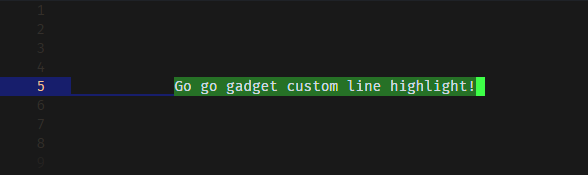
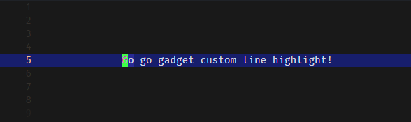

# Custom Line Highlight (Visual Studio Code Extension)

This is a simple Visual Studio Code extension, adapted from the (seemingly-abandoned) [highlight-line](https://github.com/cliffordfajardo/highlight-line-vscode) extension by [Clifford Fajardo](https://github.com/cliffordfajardo).

This extension is intended to be used in conjunction with the `"editor.renderLineHighlight": "gutter"` setting (otherwise, it's redundant).

## Features:

- Supports multiple editors
- Doesn't overlap selection highlights
- Customizable height (defaults to `1.4em`, however you can specify a height in pixels too)
- Custom colours for active vs inactive editors

## Previews:

Custom line highlight with the default line highlight set to Gutter: 

And with a selection: 

And with the full-line highlight: 

## Changelog:

v0.1.0 (current):
 - Fixed line highlight not showing in other editors
 - Fixed line highlight not appearing on startup
 - Renamed (and added new) config options
 - Large code re-structuring & cleanup
    - <em>Remember, I'm new to TypeScript (and I don't like it much)</em>
    - Stopped using the wrong variables inside functions (now referencing the parameters instead!)
    - Bundled up the decoration types into a structure
    - Separated the code for full-line highlights and partial highlights
    - Added more events to hopefully keep the line highlight up-to-date when doing things like switching editors

v0.0.1:
 - Created the extension!